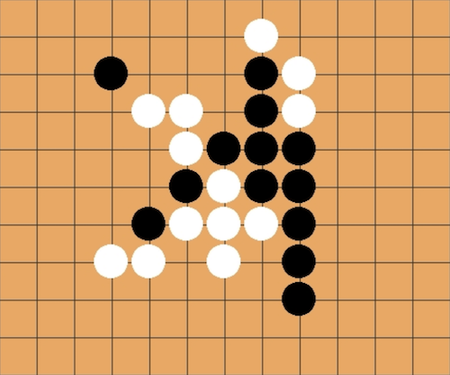

# Gomoku



Basic Gomoku AI written in Golang.

to run:

```go run gomoku.go```

### Components:

Go webserver: TODO

### How the AI works

There are three components to how the AI determines its next move:

Todo:
Heat Score
Win potential score
One-away score

Todo: flesh out README.md
